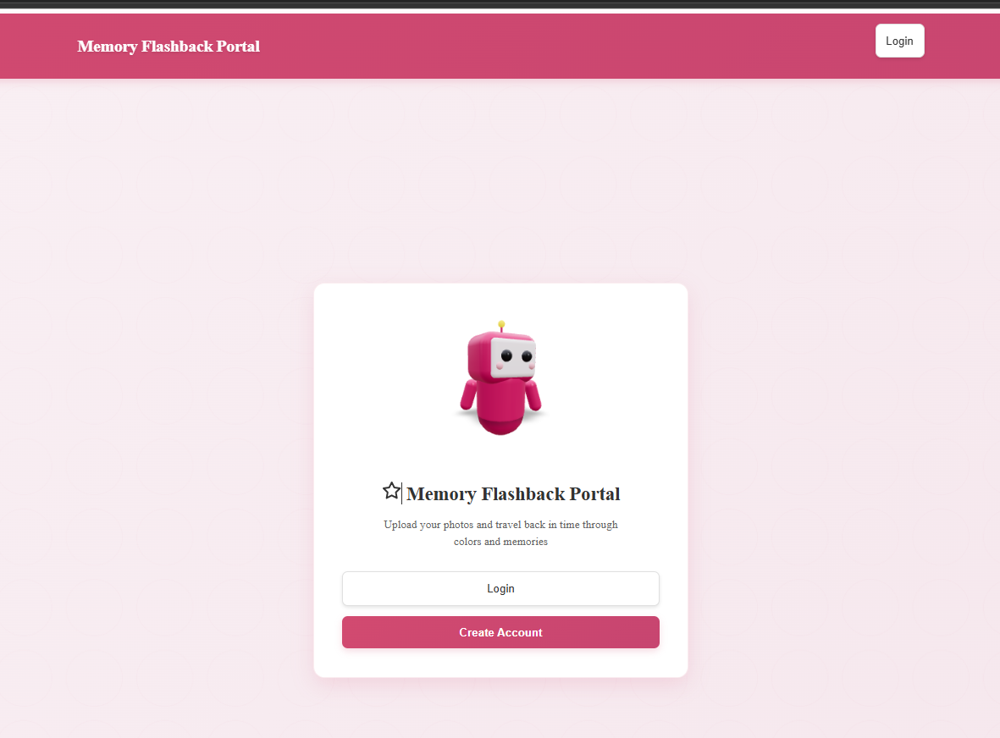
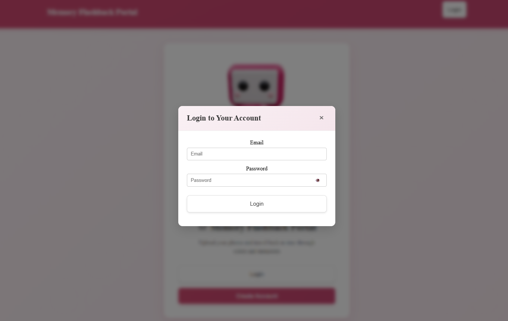
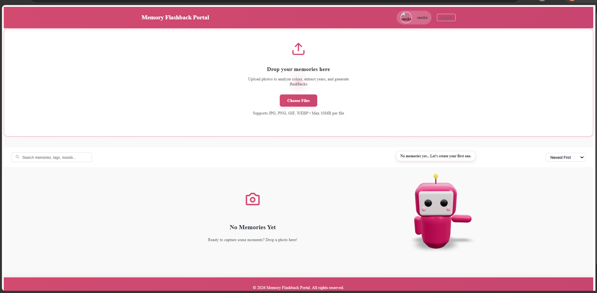
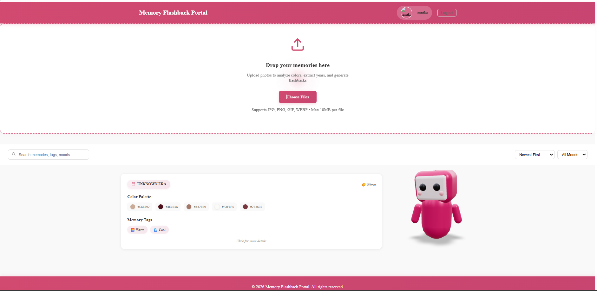
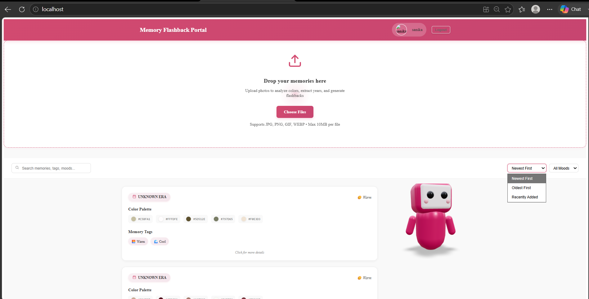
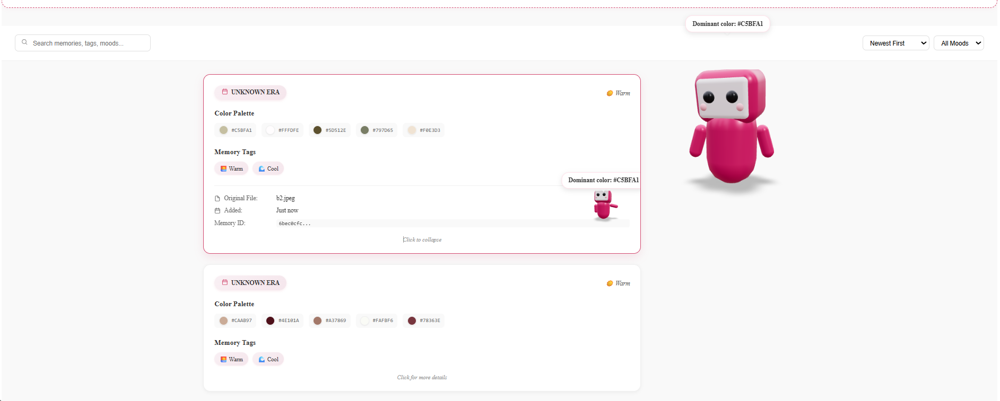

# Memory Flashback Portal

Memory Flashback Portal is a comprehensive full-stack web application designed to help users preserve, organize, and revisit their photos and memories over time. With a secure authentication system, intuitive media uploading, and dynamic timeline visualization, the application provides a personalized portal for managing personal history.

---

## Screenshots








---

## Architecture Overview

The application follows a standard client-server architecture, containerized for easy deployment and scaling.
* **Frontend**: A React single-page application (SPA) providing a responsive and interactive user interface.
* **Backend**: A Spring Boot REST API handling business logic, authentication, and data persistence.
* **Database**: A MySQL relational database for robust data storage.

---

## Detailed Tech Stack

### Frontend Ecosystem
* **React 18**: Core UI library for building component-based interfaces.
* **Axios**: Promise-based HTTP client for seamless REST API communication.
* **React Icons**: For lightweight, scalable vector icons in the UI.
* **Vanilla CSS**: Custom styling ensuring full control over the application's aesthetic without external dependencies.

### Backend Ecosystem
* **Java 21**: The underlying programming language for the backend.
* **Spring Boot 3.5.x**: Application framework for rapid development.
* **Spring Security**: Comprehensive security framework handling authentication and authorization.
* **Spring Data JPA**: Abstraction layer for interacting with the MySQL database using Java objects.
* **Maven**: Dependency management and build tool.
* **MySQL Connector/J**: Driver for connecting the Spring Boot application to the MySQL database.

### DevOps & Infrastructure
* **Docker**: Container engine for isolating application environments.
* **Docker Compose**: Tool for defining and running multi-container Docker applications.

---

## Project Structure

```text
/ (Root)
├── backend/                  # Spring Boot Java application
│   ├── src/main/java/        # Application source code
│   │   └── com/memory/memory_portal/
│   │       ├── config/       # Security, CORS, and application configurations
│   │       ├── controller/   # REST API endpoints (Auth, Uploads)
│   │       ├── exception/    # Custom exception handling
│   │       ├── model/        # JPA Entities (User, Memory, etc.)
│   │       ├── repository/   # Database access interfaces
│   │       └── service/      # Business logic and services
│   └── pom.xml               # Maven configuration and dependencies
│
├── frontend/                 # React frontend application
│   ├── public/               # Static assets (index.html, logos)
│   ├── src/                  # React source code
│   │   ├── components/       # Reusable UI components (Header, MemoryCard, Mascot, etc.)
│   │   ├── styles/           # CSS stylesheets grouped by component
│   │   ├── App.js            # Main application layout and routing
│   │   └── index.js          # React entry point
│   └── package.json          # NPM dependencies and scripts
│
└── docker-compose.yml        # Multi-container orchestration configuration
```

---

## Key Features

1. **Secure User Authentication**
   * Registration and Login functionality.
   * Session management protected via Spring Security.
   * CSRF protection integrated with Axios requests.

2. **Memory Management**
   * **Upload**: Securely upload and store media files (images).
   * **Timeline**: View an organized timeline of uploaded memories.
   * **Metadata**: Attach moods, tags, and years to memories for context.
   * **Deletion**: Safely delete existing memories from the portal.

3. **Advanced Filtering & Search**
   * Search through memories based on specific tags, file names, or moods.
   * Filter memories dynamically by specific years or date ranges.
   * Sort memories chronologically (newest, oldest, or recently added).

4. **Interactive Dashboard**
   * View memory statistics (total years tracked, oldest memory, newest memory).
   * Interactive "Mascot" that responds dynamically to user actions (e.g., uploading, milestones).

---

## Setup and Installation

### Prerequisites
* **Docker** and **Docker Compose** (Recommended approach).
* Alternatively, for manual setup: Node.js (v18+), Java (JDK 21), Maven, and a running MySQL instance.

### Running with Docker (Recommended)

1. Clone or download the repository to your local machine.
2. Open a terminal and navigate to the root directory of the project.
3. Build and start the containers using Docker Compose:
   ```bash
   docker-compose up -d --build
   ```
4. Access the application:
   * **Frontend Application**: `http://localhost:80`
   * **Backend API**: `http://localhost:8080`
5. To stop the application, run:
   ```bash
   docker-compose down
   ```

### Manual Local Development Setup

If you wish to run the applications outside of Docker for development purposes:

**1. Database Setup**
* Ensure MySQL is running on your local machine.
* Create a database named `memory_portal`.
* Update the `application.properties` or `application.yml` in the `backend/src/main/resources` folder with your local MySQL credentials.

**2. Backend Setup**
* Navigate to the `backend` directory: `cd backend`
* Build the project using Maven: `./mvnw clean install` (or `mvn clean install`)
* Run the Spring Boot application: `./mvnw spring-boot:run`
* The backend will start on `http://localhost:8080`.

**3. Frontend Setup**
* Navigate to the `frontend` directory: `cd frontend`
* Install the NPM dependencies: `npm install`
* Start the development server: `npm start`
* The frontend will start on `http://localhost:3000` (Note: Ensure API endpoints in the frontend code are pointing to the correct backend port if modified).

---

## API Endpoints Overview

* `GET /api/user-info` - Retrieve details of the currently authenticated user.
* `GET /api/auth/csrf` - Retrieve the CSRF token for secure state-changing requests.
* `GET /api/memories` - Fetch all memories for the authenticated user.
* `POST /api/memories` - Upload a new memory file with associated metadata.
* `DELETE /api/memories/{id}` - Delete a specific memory by its ID.
